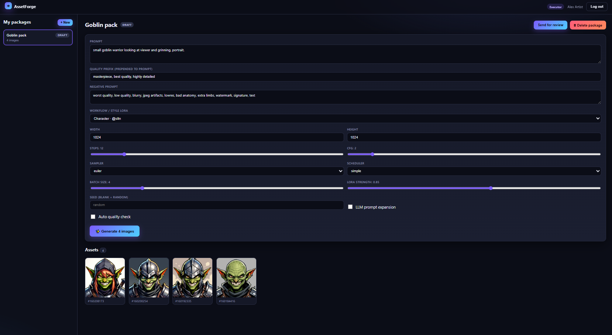
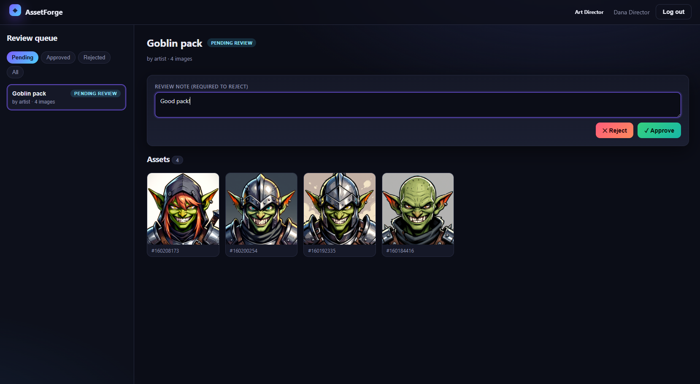
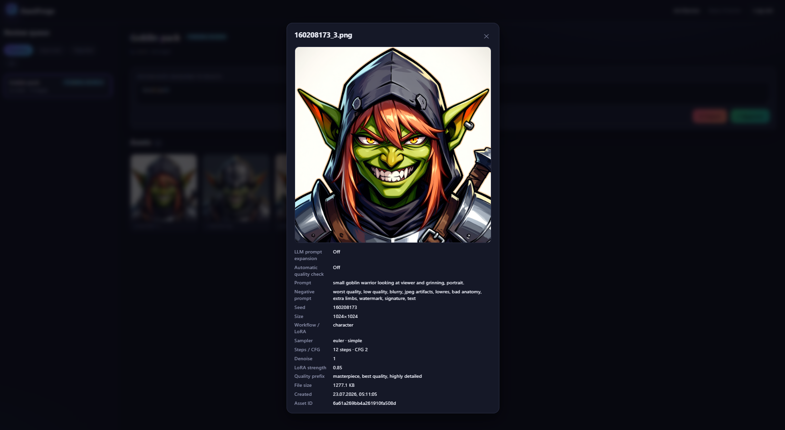
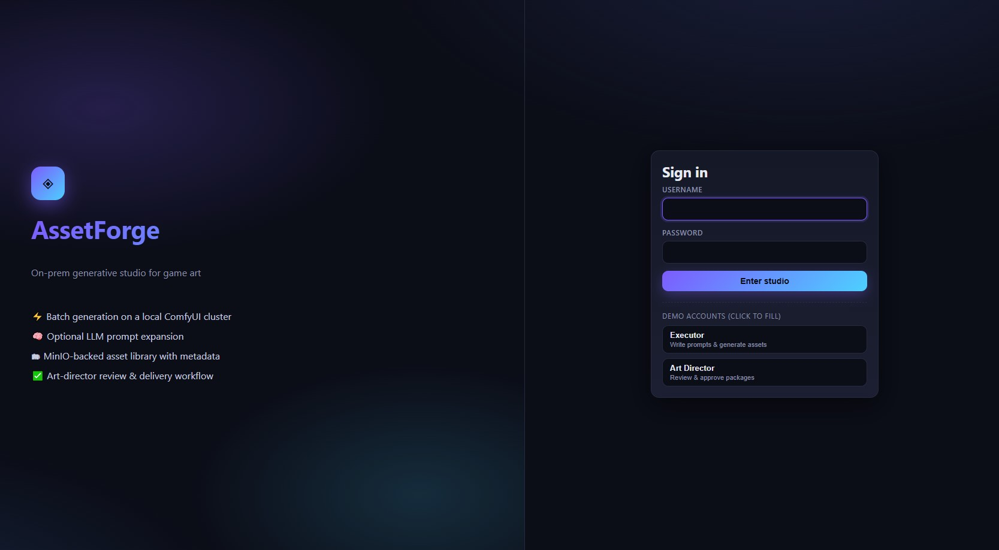

# 🎮 AssetForge — сервис генерации игровых ассетов

<p align="center">
  
</p>

<p align="center">
  
  
  
  
  
  
  
  
  
  
</p>

Веб-сервис, превращающий текстовые промпты в стилизованные игровые ассеты
(персонажи, иконки-пропсы) через локальный **ComfyUI** с обученными style-LoRA.
Результаты и метаданные хранятся в **MinIO + MongoDB** и проходят процесс
согласования **«исполнитель → арт-директор → выдача»**.

> 🔬 Продукт вырос из исследовательской части (EDA, обучение LoRA, бенчмарки
> KID/CLIP/LPIPS) — она вынесена в **[`docs/`](docs/README.md)**.

---

## ⚡ Быстрый старт (без GPU, mock-режим)

```bash
cd service
docker compose -f docker-compose.demo.yml up --build
# UI: http://localhost:5173  ·  API + Swagger: http://localhost:8000/docs
```

Демо-аккаунты создаются автоматически:

| Роль          | Логин      | Пароль        |
|---------------|------------|---------------|
| Исполнитель   | `artist`   | `artist123`   |
| Арт-директор  | `director` | `director123` |

Полноценный GPU-режим (реальный инференс ComfyUI + авто-загрузка моделей) —
см. раздел [«Развёртывание»](#5-развёртывание).

---

## 🖼️ Скриншоты

> _Плейсхолдеры — как добавить свои скриншоты, см. блок ниже._

| Исполнитель: генерация | Арт-директор: ревью |
|---|---|
|  |  |

| Просмотр ассета (метаданные + QA) | Логин |
|---|---|
|  |  |

<!--
📸 КАК ДОБАВИТЬ СКРИНШОТЫ (сделай сам, файлы уже прописаны выше):
  1. Запусти сервис: cd service && docker compose -f docker-compose.demo.yml up --build
  2. Открой http://localhost:5173 и войди под нужной ролью.
  3. Сделай 4 скриншота (PrintScreen / Win+Shift+S) и сохрани их РОВНО с такими именами
     в папку  docs/assets/ :
       • screenshot-login.png     — экран входа (страница логина)
       • screenshot-executor.png  — режим ИСПОЛНИТЕЛЯ: панель промпта + параметров + галерея
                                    (логин artist / artist123, создать пакет, сгенерировать батч)
       • screenshot-director.png  — режим АРТ-ДИРЕКТОРА: список пакетов на согласовании
                                    (логин director / director123, пакет в статусе pending_review)
       • screenshot-lightbox.png  — открытый ассет (клик по картинке): видно метаданные,
                                    LLM-промпт и результат авто-QA
     Плюс по желанию логотип:
       • docs/assets/logo.png     — лого проекта (480px шириной), иначе убери  из шапки.
  4. Папки docs/assets/ ещё нет — создай её при сохранении первого файла.
  5. Проверь, что имена и расширения .png совпадают буква-в-букву с путями выше — тогда
     картинки сразу подхватятся в README на GitHub. Закоммить их: git add docs/assets && ...
-->

---

## 1. Архитектура

```
                 ┌──────────────────────────────────────────────┐
                 │                  Frontend (SPA)               │
                 │      React + Vite + TS, отдаётся через nginx   │
                 │   • Исполнитель: промпты, параметры, батчи     │
                 │   • Арт-директор: приём/отклонение пакетов     │
                 └───────────────┬──────────────────────────────┘
                                 │  /api (nginx reverse-proxy)
                                 ▼
                 ┌──────────────────────────────────────────────┐
                 │             Backend REST API (FastAPI)         │
                 │   auth (JWT) · packages · generation · review  │
                 └───┬───────────────┬───────────────┬───────────┘
        Beanie ODM   │               │ Celery task   │ presigned/stream
                     ▼               ▼               ▼
              ┌────────────┐  ┌────────────┐  ┌────────────┐
              │  MongoDB   │  │   Redis     │  │   MinIO    │
              │ доменная   │  │ брокер +    │  │ бинарники  │
              │  модель    │  │ результаты  │  │ картинок   │
              └────────────┘  └─────┬──────┘  └────────────┘
                                    │ разбирают очередь
                          ┌─────────▼─────────┐
                          │  Celery worker(s) │  ← масштабируются:
                          │  --scale worker=N │    docker compose up --scale worker=N
                          └─────────┬─────────┘
                                    │ HTTP workflow
                    ┌───────────────┼───────────────┐
                    ▼                               ▼
             ┌────────────┐                  ┌────────────┐
             │  ComfyUI   │  (GPU)           │  Ollama    │  (LLM prompt expand)
             │  base+LoRA │                  │  qwen2.5   │
             └────────────┘                  └────────────┘
```

Ключевая идея — **разделение синхронного API и асинхронной генерации**. API
только ставит задачу в очередь и мгновенно отвечает `job_id`; тяжёлую работу на
GPU выполняют воркеры, которых можно горизонтально масштабировать под нагрузку.

---

## 2. Доменная модель

Роли (`UserRole`): `executor` (исполнитель), `art-director` (арт-директор).

| Сущность    | Назначение                                                             |
|-------------|------------------------------------------------------------------------|
| **User**    | Учётная запись, роль определяет доступный интерфейс и права.           |
| **Package** | Единица согласования — набор ассетов на одну тему. Проходит статусы.   |
| **Job**     | Одна задача генерации (1 промпт → батч из N картинок), статус выполнения.|
| **Image**   | Метаданные ассета (промпт, seed, размеры, workflow, QA) + ключ в MinIO. |
| **Review**  | Решение арт-директора (approve/reject) с комментарием, история.        |

**Жизненный цикл пакета** (`PackageStatus`):

```
draft ──generate──▶ (draft) ──submit──▶ pending_review
   ▲                                          │
   │                                    ┌──────┴───────┐
   └──────────── reject ◀───────────────┤  art-director │
                                        └──────┬───────┘
                                          approve
                                               ▼
                                           approved ──▶ download / в производство
```

- Исполнитель редактирует и генерирует только пока пакет `draft`/`rejected`.
- После `submit` пакет блокируется на редактирование и ждёт ревью.
- `approved` пакет доступен для скачивания ZIP-архивом.

---

## 3. Технологический стек

| Слой            | Технологии                                                        |
|-----------------|-------------------------------------------------------------------|
| Frontend        | React 18, TypeScript, Vite, nginx                                 |
| Backend / REST  | FastAPI, Pydantic v2, JWT (python-jose), Passlib                  |
| СУБД / ODM      | MongoDB 7 + Beanie (async ODM поверх Motor)                       |
| Object storage  | MinIO (S3-совместимое), клиент `minio`                            |
| Очередь / воркеры | Celery + Redis (broker & result backend)                        |
| Инференс        | **Anima Base (Cosmos2)** через ComfyUI, Ollama (LLM prompt expand) |
| Качество (QA)   | CLIP-score (соответствие промпту) + LPIPS (разнообразие батча)    |
| Тесты           | pytest, mongomock, ASGITransport (42 теста)                       |
| Упаковка        | Docker, docker-compose (demo + GPU-prod), CI на GitHub Actions    |

---

## 4. Структура репозитория

```
/
├── README.md              ← вы здесь: продукт (архитектура, деплой, API)
├── LICENSE                ← MIT
├── CONTRIBUTING.md        ← правила вклада (Conventional Commits, ветки, тесты)
├── .github/workflows/     ← CI: pytest (backend) + tsc (frontend)
├── service/               ← 🚀 MVP-сервис (весь исполняемый код)
│   ├── docker-compose.yml       # production-стек (реальный GPU-инференс)
│   ├── docker-compose.demo.yml  # demo-стек (без GPU, mock)
│   ├── backend/                 # FastAPI API + Celery worker + тесты
│   ├── frontend/                # React SPA (Executor + Director)
│   ├── comfyui/ · ollama/ · models/   # инференс и авто-загрузка весов
│   └── README.md                # подробная документация сервиса
└── docs/                  ← 🔬 исследование (EDA, baseline, MLflow, бизнес-план)
    └── README.md                # навигация по исследованию
```

Подробная документация сервиса (полная структура backend, provenance образов,
модели инференса) — в **[`service/README.md`](service/README.md)**.

---

## 5. Развёртывание

Два режима: **demo** (запускается где угодно, без GPU) и **production**
(реальный GPU-инференс).

### 5.1. Demo (без GPU)

```bash
cd service
docker compose -f docker-compose.demo.yml up --build
```

Воркер генерирует детерминированные placeholder-картинки (`COMFYUI_MOCK=true`),
но всё остальное реально: авторизация, очередь Celery, MongoDB, MinIO,
согласование, скачивание. `.env` не требуется.

### 5.2. Production (GPU, одна команда)

**Требования:** NVIDIA GPU + NVIDIA Container Toolkit + ~30 ГБ на диске.

```bash
cd service
cp .env.example .env
docker compose up --build -d
```

При первом запуске автоматически: сборка ComfyUI из офиц. репозитория,
скачивание Anima Base + LoRA из HuggingFace, auto-pull LLM `qwen2.5:3b` в Ollama.

| Сервис        | URL                        |
|---------------|----------------------------|
| UI            | http://localhost:5173      |
| API + Swagger | http://localhost:8000/docs |
| ComfyUI       | http://localhost:8188      |
| MinIO консоль | http://localhost:9001      |

> ⚠️ demo и production делят порты — не запускайте одновременно.
> Полные инструкции и нюансы — в [`service/README.md`](service/README.md).

---

## 6. Масштабирование воркеров

Генерация вынесена в отдельный сервис `worker`, масштабируется горизонтально
без изменения кода — реплики разбирают одну очередь Redis:

```bash
docker compose up --scale worker=4
```

Каждый воркер — отдельный процесс Celery (`--concurrency=1`), что для
GPU-инференса корректнее, чем много потоков в одном процессе.

---

## 7. REST API (кратко)

Базовый префикс `/api/v1`, авторизация `Authorization: Bearer <JWT>`.

| Метод | Путь                          | Роль          | Описание                          |
|-------|-------------------------------|---------------|-----------------------------------|
| POST  | `/auth/login`                 | —             | Логин, выдача JWT                 |
| GET   | `/packages?status=`           | обе           | Список пакетов (для роли)         |
| POST  | `/packages`                   | executor      | Создать пакет                     |
| POST  | `/packages/{id}/generate`     | executor      | Поставить задачу генерации        |
| POST  | `/packages/{id}/submit`       | executor      | Отправить на согласование         |
| POST  | `/packages/{id}/review`       | art-director  | Approve / reject + комментарий    |
| GET   | `/packages/{id}/download`     | обе           | ZIP одобренного пакета            |
| POST  | `/images/{id}/regenerate`     | executor      | Ре-ролл ассета (с переопределениями) |
| GET   | `/health`                     | —             | Проверка живости                  |

Полная интерактивная спецификация — в Swagger UI (`/docs`).

---

## 8. Тесты

```bash
cd service/backend
pip install -r requirements.txt
pytest -q            # 42 passed
```

Тесты изолированы: MongoDB → `mongomock`, MinIO и ComfyUI → in-memory моки,
поэтому работают в CI без внешних сервисов. Фронтенд проверяется `tsc --noEmit`.
Оба прогона автоматически запускаются в **[CI](.github/workflows/ci.yml)** на push/PR.

---

## 9. Соответствие критериям задания

| Критерий                                | Реализация                                                        |
|-----------------------------------------|-------------------------------------------------------------------|
| Доменная модель                         | `app/models/*` (User, Package, Job, Image, Review) + статусы/роли |
| Хранение данных за счёт СУБД            | MongoDB (метаданные) + MinIO (бинарники) через Beanie/minio       |
| REST-интерфейс                          | FastAPI, версионированный `/api/v1`, Swagger                      |
| Пользовательский интерфейс             | React SPA с двумя ролевыми режимами                               |
| Покрытие тестами критичных частей       | pytest: 42 теста (unit + integration) + CI                        |
| Упаковка в Docker                       | Dockerfile backend/frontend + docker-compose (demo + prod)        |
| Масштабирование воркеров с моделью      | отдельный `worker`, `--scale worker=N`, общая очередь Redis       |

---

## 📄 Лицензия

[MIT](LICENSE).
